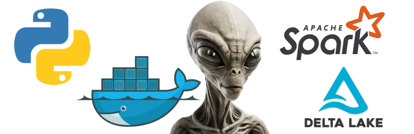

<h1 align="center"> </h1>

<h1 align="center" style="color:#40A7FF;font-size:28px"><b>UFO Sighting ELT Pipeline</b></h1>

<p align="center">
  


</p>

<p align="center">
  <a href="#about">About</a> •
  <a href="#installation">Installation</a> •
  <a href="#improvements">Improvements</a>
</p>

<h2 id="about">About</h2>

<p>This project showcases an Extract, Load, Transform (ELT) pipeline built with Python, Apache Spark, Delta Lake, and Docker. The objective of the project is to scrape UFO sighting data from the National UFO Reporting Center (NUFORC) and process it through the Medallion architecture to create a star schema in the Gold layer.</p>

<p>The pipeline begins by utilizing Python for web scraping, extracting UFO sighting data from NUFORC. The scraped data is then transformed using Apache Spark, a powerful big data processing framework. Spark enables efficient data manipulation, cleansing, and aggregation tasks on the extracted data.</p>

<p>To ensure reliability and scalability, the data is stored in Delta Lake, an open-source storage layer built on top of Apache Parquet and Apache Spark. Delta Lake provides ACID transactions, schema enforcement, and versioning capabilities, making it ideal for data pipeline workflows.</p>

<p>The project is containerized using Docker, allowing for easy deployment and reproducibility across different environments. Docker enables seamless packaging and distribution of the entire pipeline, ensuring consistent execution and dependency management.</p>

<p>The result is a well-organized ELT pipeline that follows the Medallion architecture principles, with Bronze, Silver, and Gold layers. The Bronze layer contains the raw, unprocessed data. The Silver layer represents the transformed and cleansed data, while the Gold layer consists of a star schema, enabling efficient querying and analysis.</p>

<h1 align="center"> </h1>

<h3>Key Technologies:</h3>

<ul>
  <li>Python: Web scraping and scripting language</li>
  <li>Apache Spark: Big data processing and transformation framework</li>
  <li>Delta Lake: Data storage layer with ACID transactions and versioning</li>
  <li>Docker: Containerization platform for easy deployment and reproducibility</li>
</ul>

<h3>Application services at runtime:</h3>

<ul>
  <li>One spark driver</li>
  <li>One spark master</li>
  <li>Two spark worker nodes</li>
  <li>Spark History Server</li>
  <li>Jupyter Lab</li>
</ul>

<h2 id="installation">Installation</h2>

1. Download [Docker Desktop](https://www.docker.com/products/docker-desktop/) and start docker
2. Clone Repo 
```bash
git clone https://github.com/jgrove90/ufo-deltalake.git
```
3. Run `docker_build.sh` to create docker images
```bash
sh docker_build.sh
```
4. Run `start.sh` to start the spark application
```bash
sh start.sh
```
5. Access application services via the web browser
    * Spark Master UI - `http://localhost:7070/`
    * Spark History Server -  `http://localhost:18080/`
    * Jupyter Lab - `http://localhost:8888/`
6. Run `teardown.sh` to remove application from system including docker images
```bash
sh teardown.sh
```
<h2 id="improvements">Improvements</h2>

<p>
This project is over engineered as Apache Spark is best suited for big data but I wanted to explore the use of Delta Lake, which was the main focus of this project. Instead I could have used any of the following packages to perform transformations without the use of Apache Spark and most likely would receive a performance boost.

<ul>
  <li>Pandas</li>
  <li>Polars</li>
  <li>Delta-rs</li>
  <li>DuckDB</li>
</ul>

More features could have been added to the silver table such as:

<ul>
  <li>Other astronomical events</li>
  <li>Geocoding addresses using an API (attemped but would cost money)</li>
  <li>Links to pictures</li>
  <li>Include slowy changing dimensions as updates are made to the website</li>
</ul>

Finally, a more indepth statistical analysis could be performed using: 

<ul>
  <li>Jupyter Lab</li>
  <li>Dashboards (might revisit this in PowerBI)</li>
</ul>
</p>